# Camera Configuration

The setups need a camera to record the sessions and to monitor the task in real time. Since there's a need for the video to be recorded with some specific settings, this section contains instructions explaining how to configure PointGrey and FLIR cameras, which are the two types of cameras used.

## Desired Camera Settings

As mentioned above, there is a need for the camera used in the setup to have some specifications, namely:
- a frame rate if 100 fps.
- the ability for the camera to send a pulse to the Harp Behavior every time a frame is being acquired.
- the ability to receive a pulse from the Harp Behavior when the animal is poking in the central port (by making one of the Behavior's digital outputs mimic the central port digital input).

## FLIR

After installing the [Spinnaker Drivers](software.md#flir), connect the camera to the computer in an USB-3.0 port (connecting it to an USB-2.0 port limits the camera's capabilities, namely the frame rate).

### Firmware Update

In order to access the state of the GPIO pins in the camera model BFS-U3-16S2M-CS, it's necessary that the firmware version [2207.2.1.0](https://teledyne.app.box.com/s/nug2qb3auxty1betfu5tkpp5kcnkihn8) is installed. Follow the instructions to verify the firmware version currently installed and install a different version in case it's necessary.

1. Open the SpinView software.
2. Select the camera to be configured.
3. Click on the `Update Device Firmware` icon.
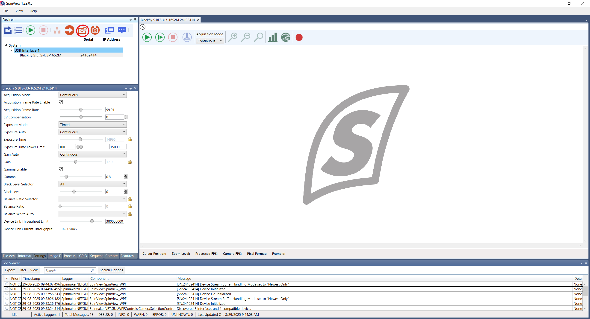
4. After a new window pops up, click on its `Browse` button to choose the firmware file. Then, click on `Start`.
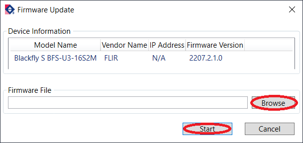

### Camera Configuration

After having the correct firmware version installed, follow the instructions to configure the camera.

1. Open the SpinView software. 
2. Select the camera to be configured.
3. Click on the `Optimize camera frame rate` button (see the figure below).
4. Click on `Features`.
5. Click on the camera model name and then on `Acquisition Control`.
6. Change the `Acquisition Frame Rate` parameter to the desired value. Confirm that the `Acquisition Frame Rate Enable` setting is checked.
7. Change the `Exposure Auto` setting to `Off` and adjust the `Exposure Time` to the maximum possible so that the acquisition stays stably at 100 FPS.
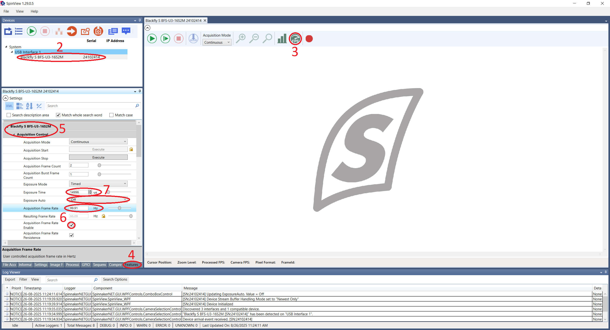
8. Close the `Acquisition Control` section and open the one named `Digital IO Control`.
9. Select the `Line 2` in the `Line Selector` parameter.
10. Change the `Line Mode` to `Output`.
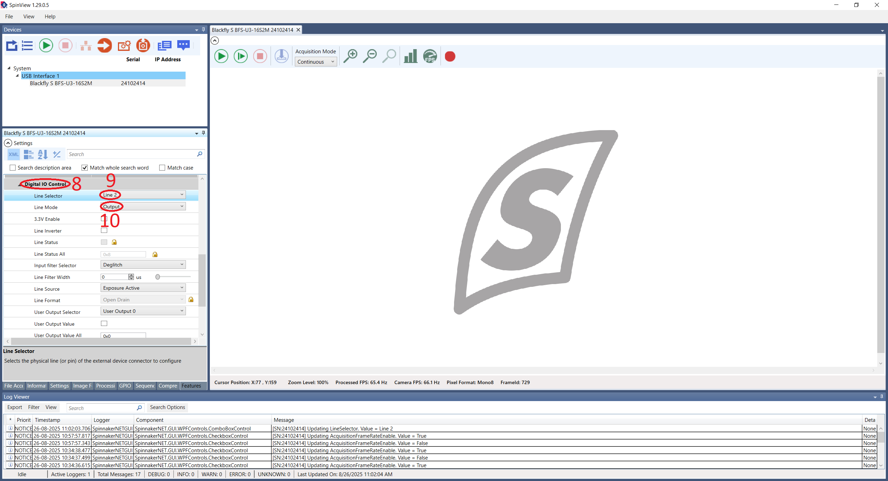
11. Close the `Digital IO Control` section and open the one named `User Set Control`.
12. Select an `User Set Selector` other than `Default`.
13. Select the same User Set in the `User Set Default` parameter.
14. Finally, click on the `User Set Save` button to save the current User Set.
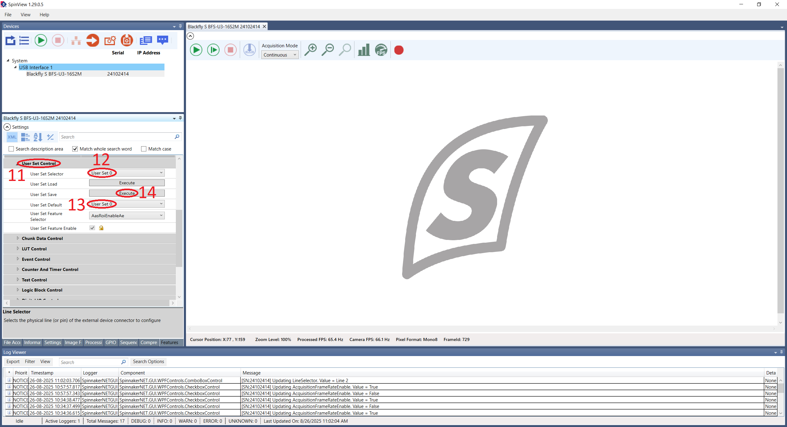
15. _Optional_: Click on `Image Format` to change the camera resolution and save the User Set again.
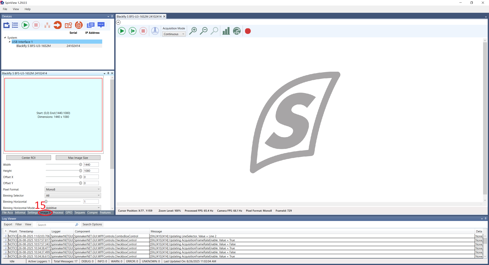

### Hardware Connections

In order for the camera to be able to communicate with the Harp Behavior, it's necessary that the [camera GPIO cable](https://machinevisiondirect.com/es/products/cei-mva-50-3-x-3m) is connected. The following connections shall be made:
- Line 2 (pin 3) from the camera to the Behavior's DI3 pin.
- Line 0 (pin 2) from the camera to the Behavior's DO0 pin.

> [!WARNING]
> Don't forget to connect the camera's grounds (pins 5 and 6) to the Harp Behavior's GND pins!

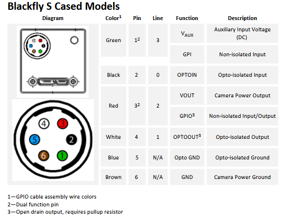

#### GPIO Cable Color Code
The color code for the [CEI MVA-50-3-X-3]((https://machinevisiondirect.com/es/products/cei-mva-50-3-x-3m)) camera GPIO cable is as follows:

| Pin |  Color |
|:---:|:------:|
|  1  |  White |
|  2  |  Brown |
|  3  |  Green |
|  4  | Yellow |
|  5  |  Gray  |
|  6  |  Pink  |
|  H  | Shield |

## PointGrey

After installing the PointGrey Drivers, connect the camera to the computer in an USB-3.0 port (connecting it to an USB-2.0 port limits the camera's capabilities, namely the frame rate).

### Camera Configuration

To configure a PointGrey camera follow the instructions below.

1. Open the Point Grey FlyCap2 software.
2. Select the camera to be configured and click on the `Configure Selected` button.
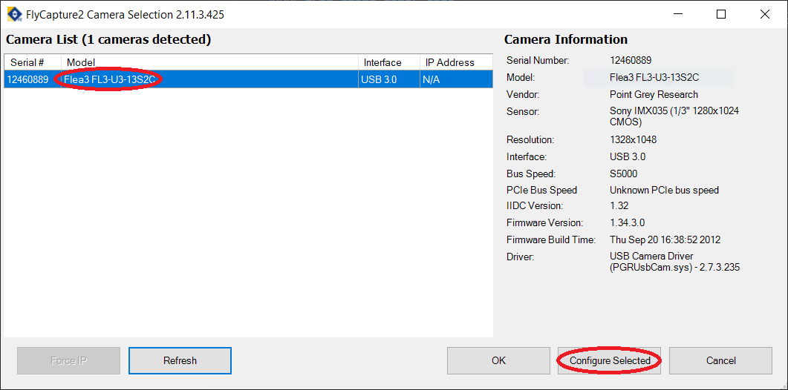
3. In the `Camera Settings` tab, activate the `On/Off` checkbox from the `FrameRate` row and modify its value.
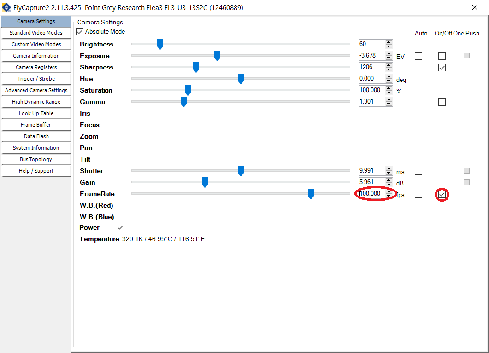
4. Go to the `Trigger / Strobe` tab.
5. Select the GPIO 0 to be an input and the GPIO 2 to be an output.
6. Under `Strobe Control`, activate the `Enable strobe for this pin` checkbox for GPIO 2 and change the polarity to `High`.
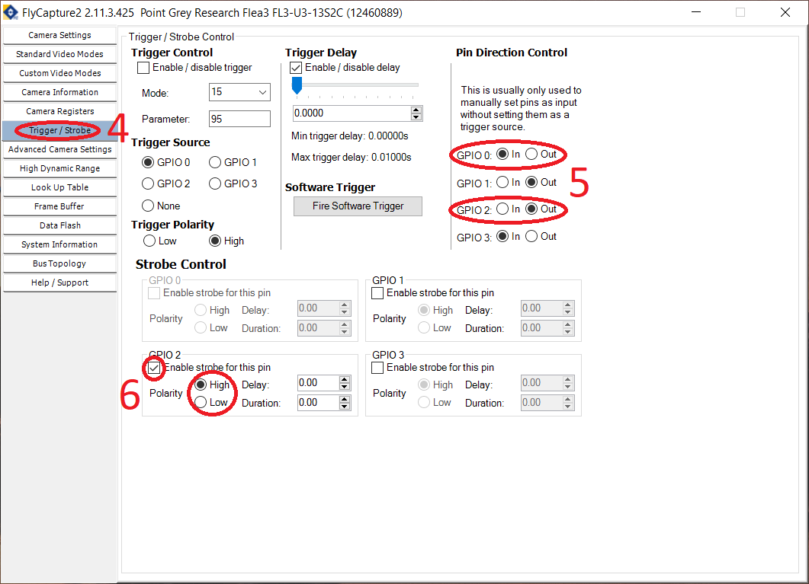
7. Go to the `Advanced Camera Settings`.
8. In the `Embedded Image Information`, select the following fields:
    - Timestamp
    - Frame counter
    - Strobe pattern
    - GPIO pin state
9. In the `Memory Channels` section, select a channel different from `Default` and click on `Save` to save the current configuration.
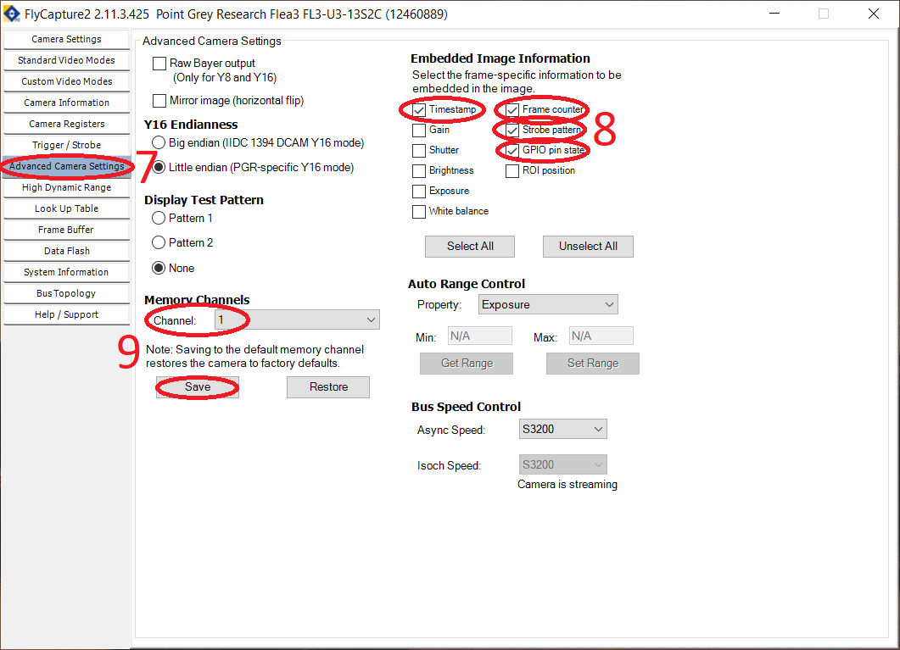
10. _Optional:_ Go to the `Custom Video Modes` and modify the camera resolution. Then save the camera configuration again.
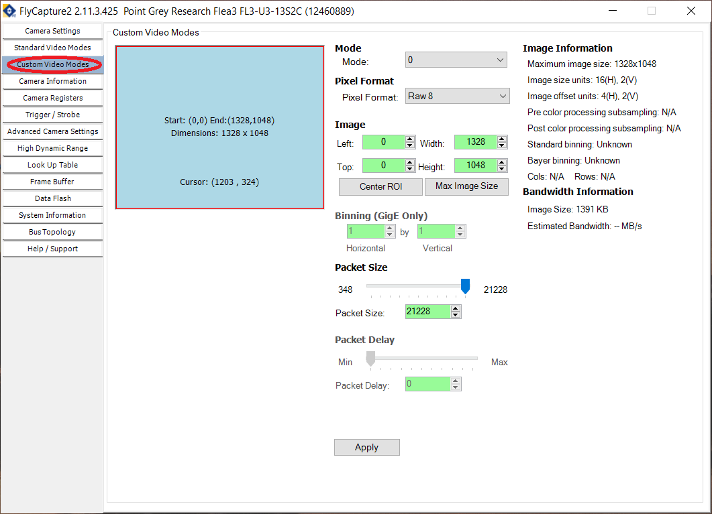

### Hardware Connections

Since the GPIO cable used by the PointGrey cameras is different from the one used by the FLIR cameras, the connections that need to be made between the camera and the Harp Behavior are also different. The connections should be made as follows:
- Pin 1 (I0) from the camera to the Behavior's DO0 pin.
- Pin 3 (IO2) from the camera do the Behavior's DI3 pin.

> [!WARNING]
> Don't forget to connect the camera's grounds (pins 5 and 6) to the Harp Behavior's GND pins!

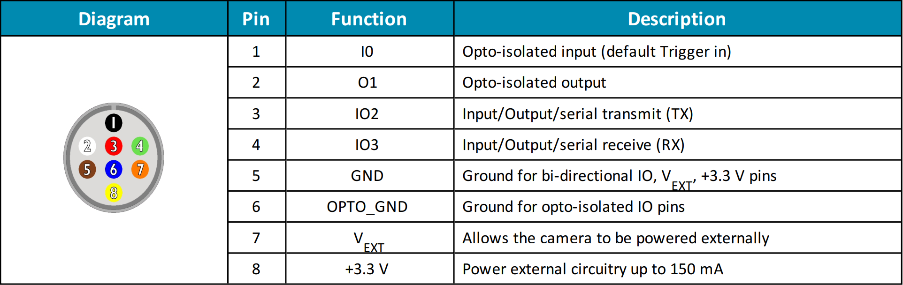

> [!NOTE]
> In the actual GPIO cable, the color of the cable corresponding to pin 5 might be purple instead of brown!
