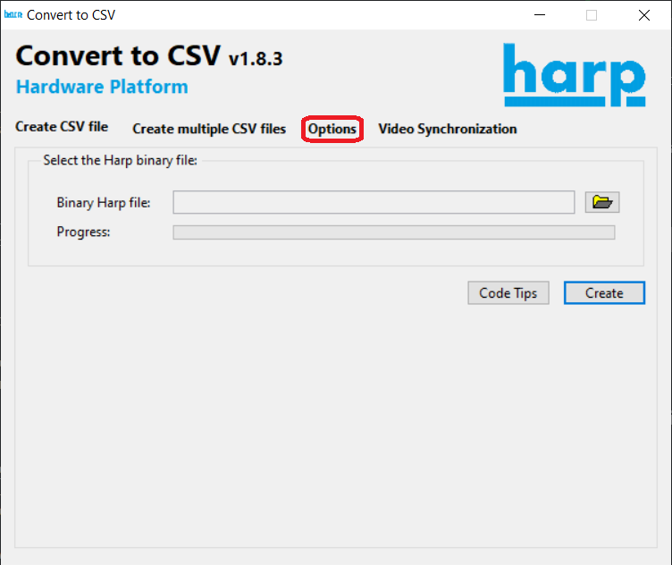
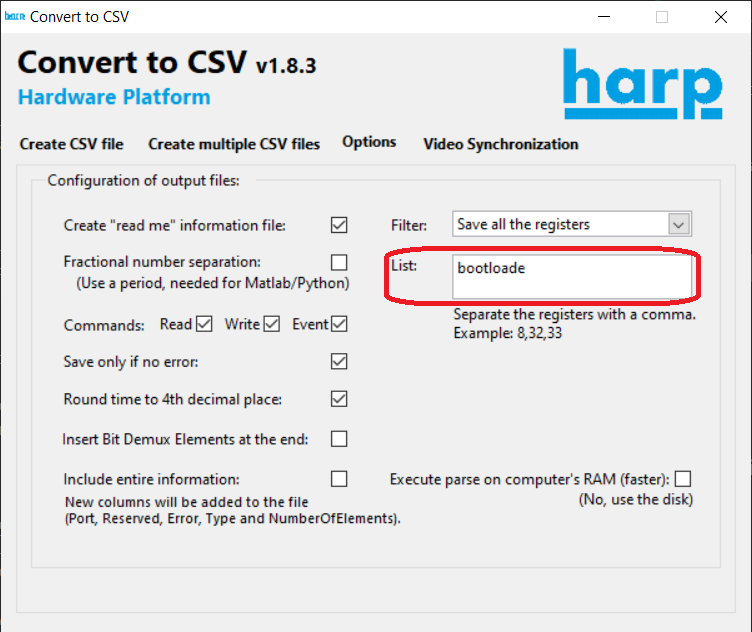
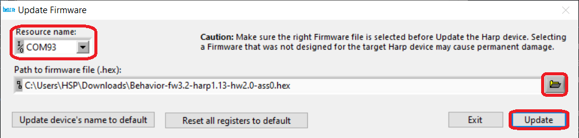
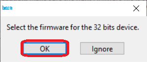

# Harp Devices Setup

In order to use the Harp devices, the USB drivers and each devices's firmware must be installed. The installer for the USB drivers can be downloaded [here](https://bitbucket.org/fchampalimaud/downloads/downloads/UsbDriver-2.12.26.zip). The [Firmware](#firmware-installation) section contains the instructions for installing each board's firmware.

> [!NOTE]
> The Harp devices are usually delivered with the firmware already installed, but it may be useful to know how to install the firmware (for example: in case a new firmware version that solves a particular bug is released)

## Firmware Installation
If the Harp Convert to CSV GUI is already installed, skip to step 3. If it's not already installed, but other Labview-based Harp board GUI is, skip to step 2 instead.

1. Install the [LabView Runtime](https://bitbucket.org/fchampalimaud/downloads/downloads/Runtime-1.0.zip) and reboot the computer.

2. Install the [Harp Convert to CSV GUI](https://bitbucket.org/fchampalimaud/downloads/downloads/Harp_Convert_To_CSV_v1.8.3.zip).

3. Open the application. Then, click on `Options`.

    

4. Write "bootloader" in the `List` textbox. The `Update Firmware` window should appear.

    

5. Choose the serial port (_COMx_) of the board and the corresponding firmware binary (`.hex` file). Then, click on `Update`. 

    

6. **For the Harp SoundCard:** during the installation of the firmware, select the PIC32 firmware when the application asks for the 32 bits device firmware (`SoundCard.X-fw2.0-harp1.4-hw2.2-ass0.hex`).

    

### Firmware Versions
You can find the firmware versions currently being used in the table below.

| Device | Firmware Version | Harp Core Version | Hardware Version | PIC32 Firmware |
|--------|:----------------:|:-----------------:|:----------------:|:--------------:|
| Harp Behavior | [v3.2](https://github.com/harp-tech/device.behavior/releases/download/fw3.2-harp1.13/Behavior-fw3.2-harp1.13-hw2.0-ass0.hex) | v1.13 | v2.0 | - |
| Harp SoundCard | [v2.3 (Custom)](https://github.com/fchampalimaud/CDC.SoundLateralizationTask/releases/download/v0.9.0/SoundCard-fw2.3-harp1.4-hw2.2-ass0.hex) | v1.4 | v2.2 | [v2.3 (Custom)](https://github.com/fchampalimaud/CDC.SoundLateralizationTask/releases/download/v0.9.0/SoundCard.X-fw2.3-harp1.4-hw2.2-ass0.hex) |
| Harp ClockSynchronizer | [v1.0](https://github.com/harp-tech/device.clocksynchronizer/releases/download/fw1.0-harp1.13/ClockSynchronizer-fw1.0-harp1.13-hw1.0-ass0.hex) | v1.13 | v1.0 | - |
| Harp SyringePump | [v1.0](https://github.com/harp-tech/device.syringepump/releases/download/fw1.0-harp1.13/SyringePump-fw1.0-harp1.13-hw1.1-ass0.hex) | v1.13 | v1.1 | - |
| Harp CurrentDriver | v0.4 | v1.13 | v1.1 | - |

> [!NOTE]
> The source code for the custom firmware of the Harp SoundCard can be found [here](https://github.com/ZegCricket/device.soundcard/tree/feature/interrupts).