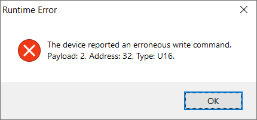

# Known Issues

This project is still being actively developed and maintained. However, since this project is composed by a lot of small parts, it's normal that some issues are discovered and, by one reason or another, can't be addressed right away. Here's a list of known issues and how to deal with them for now.

## "The Silent Crash"
This issue seems to happen randomly. Basically, what happens is that, for some reason, the workflow stops working at the end of a trial and a new trial never starts, but it's still possible to interact with some of the hardware (for example, it's still possible to deliver water). It's also not possible to "normally" close the workflow, Bonsai must be closed from the Task Manager.

For now, there's no solution to this problem, since a pattern hasn't been found yet. The only recommendation is to close and restart the task.

## Harp SoundCard Crash
It's not yet known when or why this crash happens, but it's known that it's an issue related to the Harp SoundCard firmware that makes the whole workflow explicitly crash.

If the crash shown in the above figure occurs, unplug the Harp SoundCard and plug it again before restarting the workflow.
