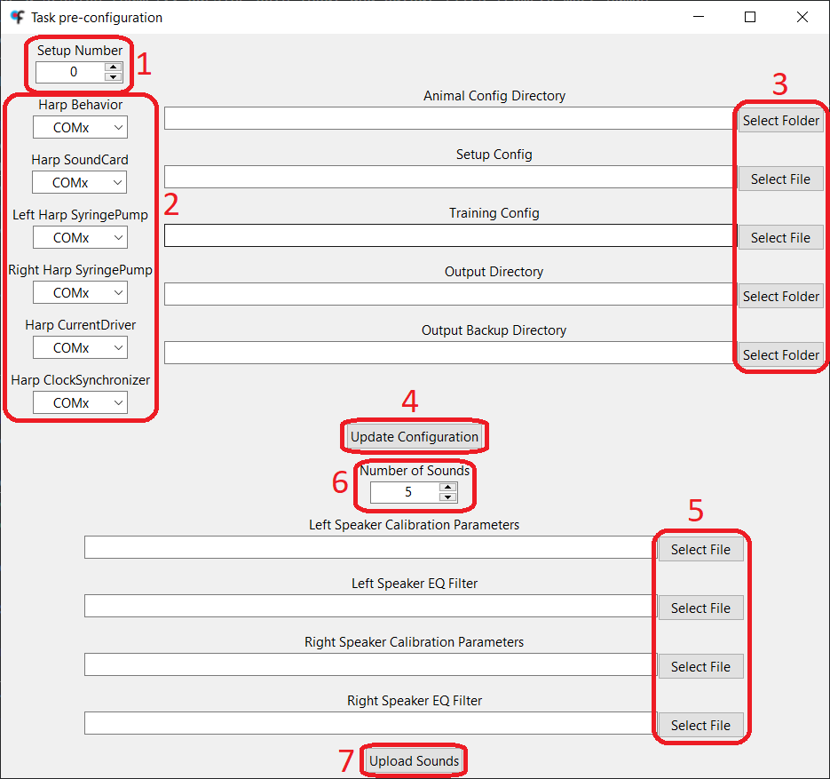

# Software Installation

The task's software is composed by the Bonsai workflow, which contains the task logic, and by small Python scripts that perform some operations at the beginning and at the end of the a session (namely, parsing both input and output files from/to more human readable formats). In order to facilitate the deployment of the project and with reproducibility in mind, the Bonsai workflow was developed inside a Bonsai environment and the Python scripts uses [uv](https://github.com/astral-sh/uv) to create and maintain the Python virtual environment.

To install the task's software, follow the steps:
1. Download the source code from the latest project [release](https://github.com/fchampalimaud/CDC.SoundLateralizationTask/releases/latest) and unzip it. Alternatively, clone the [repository](https://github.com/fchampalimaud/CDC.SoundLateralizationTask).
2. Run `./Setup.cmd` to install the Bonsai environment, the Python environment and FFmpeg and to download the necessary configuration files (`template.yml`, `setup.csv`, `training.csv`) into `./config` directory (in case these don't exist already). An application window will appear which is used to specify the setup number, the COM port of each Harp device and the paths to the configuration files and output directory.

    1. Select the setup number.
    2. Specify the serial port that corresponds to each Harp device.
        - The setup doesn't require a Harp CurrentDriver to work. This device is only used in optogenetics sessions, so if this is not going to be the use case, the serial port for this device can be ignored.
    3. Select the paths to the different input and output files.
        - The configuration files downloaded to the `./config` directory can be moved elsewhere.
        - The `template.yml` **must** be inside the animal config directory!
        - The animal config directory is where the `[animal_id].yml` file of each animal will be created inside the corresponding batch folder.
        - The output backup directory is _optional_. Video-related data will not be saved to this directory.
    4. Click on the `Update Configuration` button, which will create the `./src/config/config.yml` file, which is required to run the task.
        - Please don't move or delete the `./src/config/config.yml` file! If, for some reason, any of the paths or COM ports need to be changed, re-run the `Setup.cmd` script.
    5. To upload the sounds to the Harp SoundCard, start by selecting the files containing calibration parameters and EQ filter of each speaker. These files should have the `.npy` extension and were generated during [speaker calibration](https://fchampalimaud.github.io/cdc-speaker-calibration/) procedure.
    6. _Optional:_ Select the number of sounds to be uploaded to the Harp SoundCard.
    7. Click on the `Upload Sounds` button and wait until the process is finished (the button will be enabled again when it happens). The uploaded sounds are 10-second white noises with a sampling rate of 192 kHz.

## Camera Drivers
In order to run the Bonsai workflow that contains the task's logic, the camera drivers for the setup's camera must be installed. Instructions to install the drivers for both [FLIR](#flir) and [Point Grey](#point-grey) cameras can be found below.

### FLIR
In order to use the FLIR camera to record the sessions, install the [Spinnaker drivers](https://flir.netx.net/file/asset/54630/original/attachment). It's mandatory that the computer has the version 1.29.0.5 of the drivers installed, since the version supported by Spinnaker Bonsai Package. After opening the installer, follow the steps below:
1. Click on `Next`. Then, accept the terms and click on `Next` again.
2. Select `Application Development` and click on `Next`.
3. Deselect `GigE Driver` and click on `Next`.
4. Deselect the `I will use GigE Cameras.` checkbox and click on `Next`.
5. Finally, click on `Install`.

### Point Grey
In order to use the Point Grey camera to record the sessions, install the FlyCap2 drivers (version 2.11.3.425). After opening the installer, follow the steps below:
1. Select `FlyCapture2_x64.msi` and click on `Install`.
2. Click on `Next`. Then, accept the terms and click on `Next` again, twice.
3. Deselect the `Automatically register with PGR via the internet` checkbox and click on `Next`, twice, again.
4. Click on `Complete`.
5. Select the `I will use USB cameras` checkbox and click on `Next`.
6. Select the `Click to confirm` checkbox and click on `Next`, twice.
7. Finally, click on `Install`.

## FFmpeg
The task's code makes use of the FFmpeg software to save the video recordings in the disk, because it allows the video to be recorded with higher framerates, without loss of image quality and by making a better use of the computer's resources than the native `VideoWriter` Bonsai node.

FFmpeg can be installed with WinGet by running the following command in the Terminal:

```
winget install Gyan.FFmpeg
```
